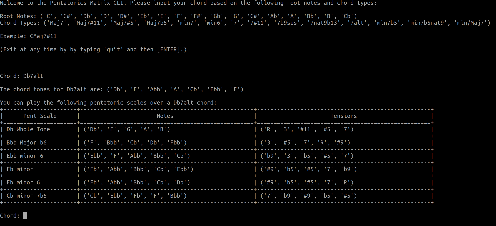

Pentatonics Matrix Command Line Interface
=========================================

.. highlight: python

.. image:: https://img.shields.io/github/license/Naereen/StrapDown.js.svg
   :target: https://github.com/Naereen/StrapDown.js/blob/master/LICENSE

A Command Line Interface (CLI) tool for choosing
which pentatonic scales to play over chords.

Motivation
----------

I am a lifelong musician and had always struggled to find an 
effective system for learning which pentatonic scales to play
over various chords. After leaning on the 
knowledge of jazz heavyweights such as Allan Holdsworth, 
Jerry Bergonzi, Scott McGill, McCoy Tyner, and many others,
I came up with the idea of a matrix.

For those of you who may not know, a pentatonic scale is simply
a scale comprised of five distinct notes. The pentatonic scale
is widely considered as one of the major cornerstones of blues,
jazz, and rock music. Dare I say it's probably the most important
improvisation tool in all of music! A bold statement, for sure,
but I stand by the statement.

Covered in this CLI are what I consider to be the most obvious
and "important" (I use the word loosely) pentatonic scales that
you can use to improvise. Because the possibilities are literally
endless, I left out some of the more advanced concepts such as
bitonal and polytonal pentatonics. I encourage you to explore
any and all possible pentatonic combinations to enrich your
musical journey.

Lastly, of course music is subjective, so your mileage may vary as to
what scales sound good over different chords. This is intended
to be a general guide and by no means an official rulebook for
playing music. Ultimately, my goal is to help other musicians
find new and exciting ways to express themselves. I hope you 
enjoy this project as much as I have in creating it.

**This project is currently in ALPHA.**

TODO
----

- [ ] tonal centers remaining: E, F, F#, Gb, G, G#, Ab, A, A#, Bb, B, Cb

- [ ] Expand README

  - [ ] Installation

  - [ ] Building from Source

- [ ] Consider adding .lower() for chord search to match all cases

- [ ] Add to PyPI

Dependencies
------------

- Python >= 3.0
- texttable

.. Installation
.. ------------
.. ::

..     pip install pentatonics-matrix-cli

.. Building from Source
.. --------------------

.. To build and install this package:

.. - Clone this repository
.. - ``./setup.py install``

Usage
-----
::

    python3 improvise.py

Running the matrix CLI will prompt you for a chord root and chord type. The output
will show the following:

- The chord tones of the specified chord.

- A list of the possible pentatonic scales in descending order from the most "in" to the most "out" sounding scales based on tensions and their relationship to the chord's tonal center.

  - The "tensions" show the relationship of the notes in the scale and how they correspond to the chord's tonal center.

.. image:: pentatonics-matrix-example.png

A Note About Enharmonics
------------------------

I tried to pay particular attention to enharmonics, notably that I did *not* use them where it would have been convenient to do so.
I did this purposely, in order to show the relationship between the chord and scale. For example, take the following output for a Db7alt chord:

While it clearly would have been easier to display an *A Major b6* pentatonic scale instead of *Bbb Major b6*, the crucial key is to understand
and internalize that over a 7alt chord you can play a Major b6 pentatonic scale starting on the b6 of the parent chord. Listing this scale with the root
of *A* is counterintuitive, as it suggests the use of a pentatonic scale located a perfect fifth above the chord root, which is technically incorrect.

With that said, I did include enharmonic tonal centers for your chord choices. So, while C# and Db are the same note enharmonically, they function differently
in certain chord progressions. For the sake of convenience I've included them both in the root note list.
