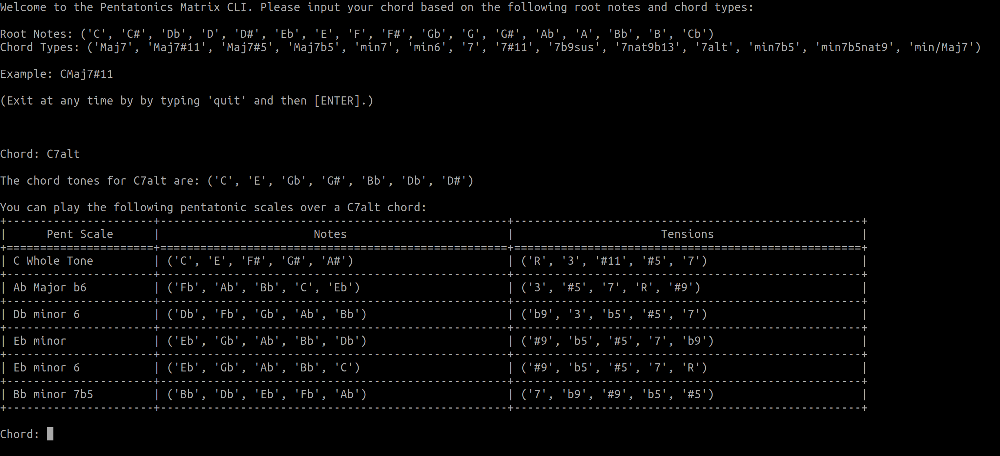

Pentatonics Matrix Command Line Interface
=========================================

.. highlight: python

A Command Line Interface (CLI) tool for choosing
which pentatonic scales to play over chords.

Motivation
----------

I am a lifelong musician and had always struggled to find an 
effective system for learning which pentatonic scales to play
over various chords. After leaning on the 
knowledge of jazz heavyweights such as Allan Holdsworth, 
Jerry Bergonzi, Scott McGill, McCoy Tyner, and many others,
I came up with the idea of a matrix.

Of course, music is subjective, so your mileage may vary as to
what scales sound good over different chords. This is intended
to be a general guide and by no means an official rulebook for
playing music. Ultimately, my goal is to help other musicians
find new and exciting ways to express themselves. I hope you 
enjoy this project as much as I have in creating it.

**This library is currently in ALPHA.**

Currently, only chords of the chord root "C" have been added. Other
chords roots will be added soon, I promise!

TODO
----

- [ ] Expand README

  - [ ] Installation

  - [ ] Building from Source

- [ ] Add loop to keep the program alive

- [ ] Finish scales for all chord roots and types

- [ ] Add CONTRIBUTING.md

- [ ] Add to PyPI

Dependencies
------------

- Python >= 3.0
- texttable

.. Installation
.. ------------
.. ::

..     pip install pentatonics-matrix-cli

.. Building from Source
.. --------------------

.. To build and install this package:

.. - Clone this repository
.. - ``./setup.py install``

Usage
-----
::

    python3 improvise.py

Running the matrix CLI will prompt you for a chord root and chord type. The output
will show the following:

- The chord tones of the specified chord.

- A list of the possible pentatonic scales in descending order from the most "in" to the most "out" sounding scales based on tensions.

  - The tensions will show the relationship of the notes being played and how they correspond to the chord's tonal center.

